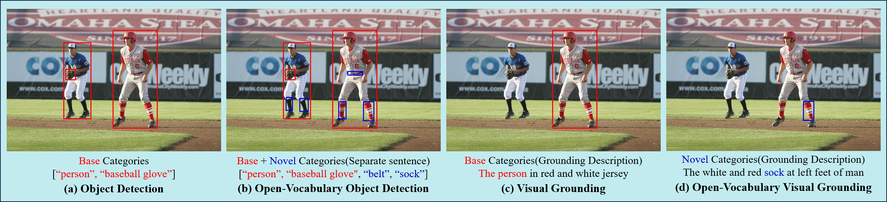
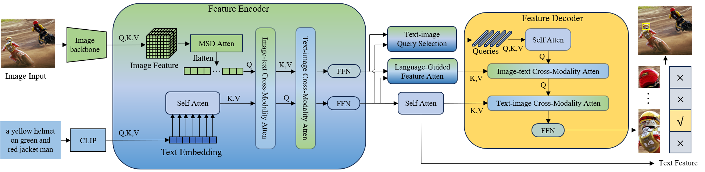

 

  <h1 align="center">OV-VG: A Benchmark for Open-Vocabulary Visual Grounding</h1>
  

     
    <strong>Chunlei Wang</strong></a>
    ·
    <strong>Wenquan Feng</strong></a>
    ·
    <a href="https://sites.google.com/view/guangliangcheng"><strong>Guangliang Cheng</strong></a>
    ·
    <a href="https://lxtgh.github.io/"><strong>Xiangtai Li</strong></a>
    ·
    <strong>Shuchang Lyu</strong></a>
    ·
    <strong>Binghao Liu</strong></a>
     
    ·
    <strong>Lijiang Chen</strong></a>
    ·
    <strong>Qi Zhao</strong></a>
     
  

## Highlight!!!!

## Abstract

Open-vocabulary learning has emerged as a cutting-edge research area, particularly in light of the widespread adoption of vision-based foundational models. Its primary objective is to comprehend novel concepts that are not encompassed within a predefined vocabulary. One key facet of this endeavor is Visual Grounding (VG), which entails locating a specific region within an image based on a corresponding language description. While current foundational models excel at various visual language tasks, there's a noticeable absence of models specifically tailored for open-vocabulary visual grounding (OV-VG). This research endeavor introduces novel and challenging OV tasks, namely Open-Vocabulary Visual Grounding (OV-VG) and Open-Vocabulary Phrase Localization (OV-PL). The overarching aim is to establish connections between language descriptions and the localization of novel objects. To facilitate this, we have curated a comprehensive annotated benchmark, encompassing 7,272 OV-VG images (comprising 10,000 instances) and 1,000 OV-PL images. In our pursuit of addressing these challenges, we delved into various baseline methodologies rooted in existing open-vocabulary object detection (OV-D), VG, and phrase localization (PL) frameworks. Surprisingly, we discovered that state-of-the-art (SOTA) methods often falter in diverse scenarios. Consequently, we developed a novel framework that integrates two critical components: Text-Image Query Selection (TIQS) and Language-Guided Feature Attention (LGFA). These modules are designed to bolster the recognition of novel categories and enhance the alignment between visual and linguistic information. Extensive experiments demonstrate the efficacy of our proposed framework, which consistently attains SOTA performance across the OV-VG task. Additionally, ablation studies provide further evidence of the effectiveness of our innovative models.

